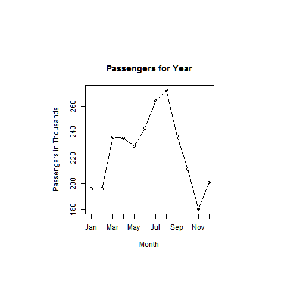

## Developing Data Projects Course Project
### Air Passengers
### Curtis Kaminski
### February 26, 2016


--- 

## Air Passengers
### This presentation was created as part of the course project for the Coursera Developing Data Projects course. The assigning required:

* The student to create an application in Slidify that accepted an input, and then performed some function based on that input
* The student to create a slidify presentation describing that product

--- .class #id

## Air Passengers
### This app uses the airPassengers dataset
### This app required the Forecast package
### This app also required the forecast and shiny libraries

---
## Air Passengers

### This app asks you to select a year between 1949 and 1960
### The app will then display a plot of the number of airline passengers for each month that year.
### The App can be found at https://curtiskam.shinyapps.io/Developing-Data-Products-Project/

---

## Sample Output


```r
library(forecast)
data(AirPassengers)
par(pin=c(3,3))
seasonplot(window(AirPassengers,start=c(1953,1),
        end=c(1953,12)), ylab="Passengers in Thousands", main="Passengers for Year")
```

 
